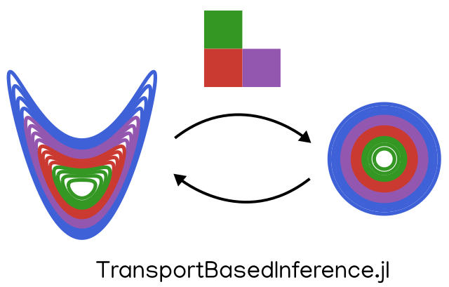

This repository contains illustrative examples for transport-based Bayesian inference. The content was presented at the UQ Workshop hosted at the University of Southern California in August, 2023.

We use the library TransportBasedInference.jl (https://github.com/mleprovost/TransportBasedInference.jl) 
developed in Julia. 

## References
[^1]: Baptista, R., Zahm, O., & Marzouk, Y. (2020). An adaptive transport framework for joint and conditional density estimation. arXiv preprint arXiv:2009.10303.

[^2]: Evensen, G., 1994. Sequential data assimilation with a nonlinear quasi‐geostrophic model using Monte Carlo methods to forecast error statistics. Journal of Geophysical Research: Oceans, 99(C5), pp.10143-10162.

[^3]: Bishop, C.H., Etherton, B.J. and Majumdar, S.J., 2001. Adaptive sampling with the ensemble transform Kalman filter. Part I: Theoretical aspects. Monthly weather review, 129(3), pp.420-436.

[^4]: Spantini, A., Baptista, R., & Marzouk, Y. (2019). Coupling techniques for nonlinear ensemble filtering. arXiv preprint arXiv:1907.00389.

[^5]: Marzouk, Y., Moselhy, T., Parno, M., & Spantini, A. (2016). Sampling via measure transport: An introduction. Handbook of uncertainty quantification, 1-41.
